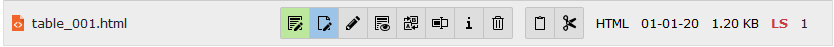
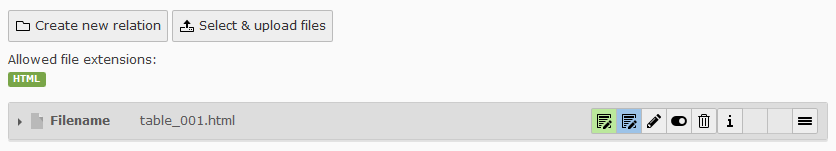

# Alm Editor
Alm Editor let you edit files with WYSIWYG-Editor in FileList and from IRRE.

## Installation
Nothing special, just install

## Settings
```
plugin.tx_almeditor {
	settings {
		fileTypes = htm,html    // Filetypes to edit
		editIrre = 1            // Enable T3-Editor from IRRE
		editIrreRte = 1         // Enable WYSIWYG-Editor from IRRE
		showIrreInfo = 1        // Enable Info-Button in IRRE
	}
}
```

## Screenshots

### Fileadmin


### IRRE


## License


Read the LICENSE.md